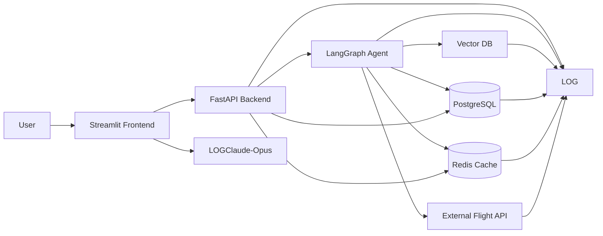

# Travel AI Agent System Diagram

## Component explanation

### 1. Streamlit frontend
- This is the user interface.
- It lets users chat with the travel assistant, enter travel preferences, and view results.
- Streamlit is useful for an MVP because it is quick to build and easy to iterate on.

### 2. FastAPI backend
- This is the main application server.
- It handles authentication, request validation, API routing, and orchestration.
- It receives requests from Streamlit and sends them to the agent layer or data services.

### 3. LangGraph agent
- This is the AI workflow engine.
- It manages multi-step reasoning, tool usage, memory, and planning.
- For a travel agent, it can decide when to search flights, query memory, or retrieve context from a vector database.

### 4. Vector DB
- Stores embeddings for unstructured information.
- Useful for semantic retrieval over travel policies, FAQs, destination guides, and previous conversation context.
- Helps the agent answer in a context-aware way.

### 5. PostgreSQL
- This is the system of record.
- Store users, trips, bookings, messages, preferences, and conversation history here.
- Best for structured and transactional data.

### 6. Redis cache
- Used for fast temporary data access.
- Good for caching frequent queries, storing session data, and rate limiting.
- Can also help reduce load on PostgreSQL and external APIs.

### 7. External flight API
- Provides live flight search and booking-related data.
- The agent calls this when the user asks about flights, availability, schedules, or prices.
- Since it is an external dependency, timeouts and retries are important.

### 8. Logging / monitoring
- Captures logs, metrics, and traces across the system.
- Helps debug issues, track latency, observe errors, and measure usage.
- Important for both product reliability and AI workflow visibility.

## How the flow works
1. The user interacts with the Streamlit frontend.
2. Streamlit sends the request to the FastAPI backend.
3. FastAPI forwards the request to the LangGraph agent.
4. The agent checks PostgreSQL for structured data.
5. The agent uses Redis for cached or short-lived data.
6. The agent queries the Vector DB for semantic context.
7. If flight data is needed, the agent calls the external flight API.
8. Logging and monitoring capture activity across all components.

## Summary
This architecture is good for an MVP because it keeps the UI simple, the backend clean, and the agent logic flexible while still supporting retrieval, caching, and live travel data.
