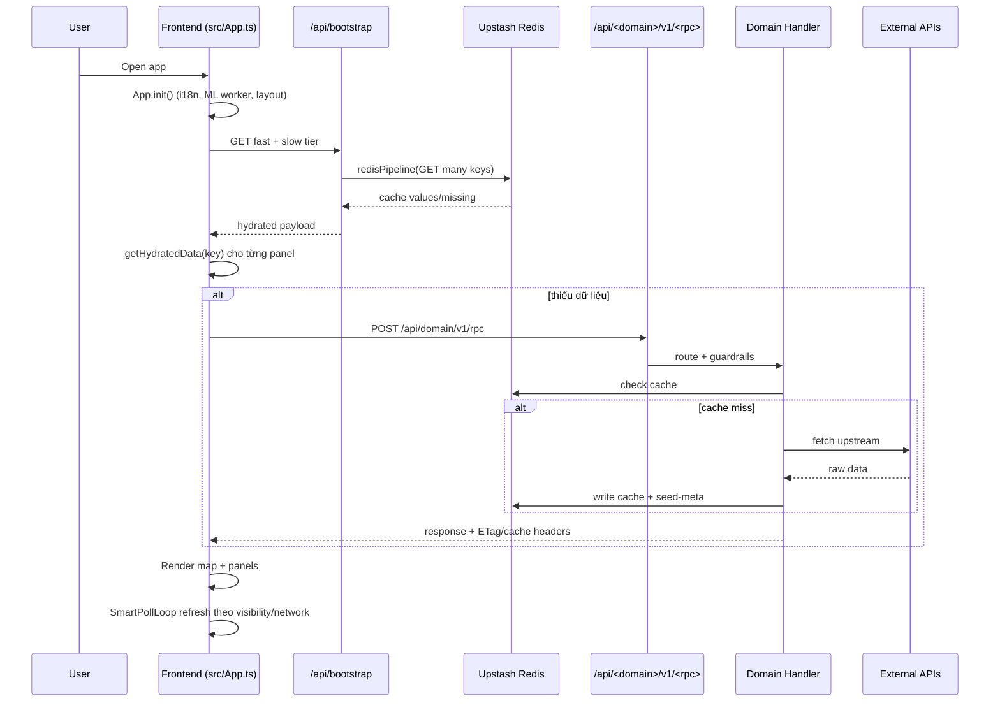
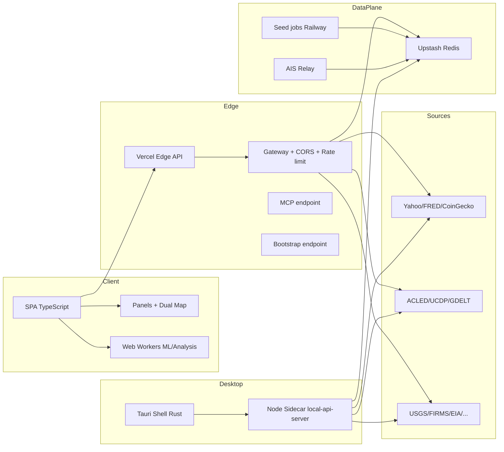

# STUDY: Tổng quan codebase World Monitor

## 1) Flowchart và Sequence Diagram

### 1.1 Flowchart (luồng dữ liệu end-to-end)

```mermaid
flowchart TD
  A[User mở app Web/Desktop] --> B[Frontend App init]
  B --> C[Fetch bootstrap fast + slow tier]
  C --> D[/api/bootstrap (Vercel Edge)]
  D --> E[Redis pipeline đọc nhiều key]
  E --> F{Có data?}
  F -- Có --> G[Trả dữ liệu hydrate cho client]
  F -- Không/thiếu --> H[Client fallback fetch theo panel RPC]
  H --> I[/api/<domain>/v1/<rpc>]
  I --> J[Gateway: CORS + API key + Rate limit + route match]
  J --> K[Domain handler server/worldmonitor/**]
  K --> L[cachedFetchJson -> Redis -> Upstream APIs]
  L --> M[Trả JSON + cache headers + ETag]
  M --> N[Panel render + map layer update]
  N --> O[SmartPollLoop refresh định kỳ]
```

### 1.2 Sequence diagram (startup + hydrate + render)



---

## 2) Nghiệp vụ codebase này dùng để làm gì?

World Monitor là dashboard **global intelligence thời gian thực**:

- Tổng hợp tin tức + dữ liệu đa nguồn (địa chính trị, quân sự, kinh tế, năng lượng, khí hậu, hàng hải, hàng không, cyber...).
- Chuẩn hóa dữ liệu thành các panel nghiệp vụ + lớp bản đồ (deck.gl/globe.gl).
- Tính các chỉ số tổng hợp như risk/resilience/correlation để hỗ trợ quan sát xu hướng và cảnh báo sớm.
- Hỗ trợ nhiều biến thể sản phẩm từ cùng một codebase (`full`, `tech`, `finance`, `commodity`, `happy`, `energy`).
- Chạy được cả Web (Vercel Edge) và Desktop (Tauri + sidecar local API).

Nói ngắn gọn: đây là hệ thống OSINT/product intelligence, ưu tiên **nhanh, chịu lỗi tốt, và luôn có fallback data**.

---

## 3) Architecture (vẽ tổng quan)



Thành phần chính trong repo:

- `src/`: frontend app (vanilla TypeScript), panel system, map system, services.
- `api/`: edge functions (bootstrap, mcp, auth, operational routes + domain RPC gateways).
- `server/worldmonitor/**`: handler nghiệp vụ theo domain, cache-first fetch pattern.
- `scripts/seed-*.mjs` + `scripts/ais-relay.cjs`: pipeline nạp dữ liệu vào Redis.
- `src-tauri/`: desktop runtime + sidecar để chạy API local.
- `proto/` + `src/generated/`: contract-first API qua protobuf/sebuf.

---

## 4) Codebase này có gì hay để học hỏi?

1. **Vanilla TS ở quy mô lớn**  
   Không dùng React/Vue nhưng vẫn tổ chức tốt qua `AppContext` + manager classes + panel base class.

2. **Bootstrap hydration 2 tầng (fast/slow)**  
   Tối ưu startup: gom nhiều key Redis thành ít request, render nhanh hơn cold start thông thường.

3. **Cache-first + stale/mixed fallback rõ ràng**  
   Thiết kế chống fail tốt: live/cached/mixed/none state giúp UI nói đúng tình trạng dữ liệu.

4. **Contract-first API (proto/sebuf)**  
   API lớn nhưng vẫn kiểm soát schema drift, typed client/server, OpenAPI đồng bộ.

5. **Edge gateway pattern chuẩn hóa**  
   CORS, auth, rate-limit, route dispatch, ETag/cache headers được gom về một luồng nhất quán.

6. **Web + Desktop dùng chung business logic**  
   Tauri sidecar load cùng handler API -> giảm lệch hành vi giữa web và desktop.

7. **Smart polling theo ngữ cảnh**  
   Refresh loop có backoff, aware tab visibility, viewport-aware để giảm lãng phí network/CPU.

8. **Tư duy vận hành (operability) tốt**  
   Có health/freshness, seed-meta, kiểm thử edge guardrails, docs-check CI để giữ kiến trúc không trôi.

---

## 5) Codebase này đang dùng AI model nào?

Theo code hiện tại, hệ thống dùng **chuỗi provider LLM fallback**:

- `ollama` (local/self-host)
- `groq`
- `openrouter`
- `generic` (endpoint OpenAI-compatible tự cấu hình)

(nguồn: [server/_shared/llm.ts](server/_shared/llm.ts#L11), [server/_shared/llm.ts](server/_shared/llm.ts#L126))

Model mặc định theo từng provider:

- **Ollama:** `llama3.1:8b`
- **Groq:** `llama-3.1-8b-instant`
- **OpenRouter:** `google/gemini-2.5-flash`
- **Generic:** `Claude-Opus`

(nguồn: [server/_shared/llm.ts](server/_shared/llm.ts#L53), [server/_shared/llm.ts](server/_shared/llm.ts#L63), [server/_shared/llm.ts](server/_shared/llm.ts#L76), [server/_shared/llm.ts](server/_shared/llm.ts#L93))

Ngoài ra có profile gọi LLM theo mục đích:

- `callLlmTool` (task nhẹ/parse): mặc định ưu tiên `groq`
- `callLlmReasoning` (task tổng hợp/suy luận): mặc định ưu tiên `openrouter`

(nguồn: [server/_shared/llm.ts](server/_shared/llm.ts#L193-L199))

Phần ML phía client (ONNX + HuggingFace qua Xenova) cũng có model riêng:

- `Xenova/all-MiniLM-L6-v2` (embedding)
- `Xenova/distilbert-base-uncased-finetuned-sst-2-english` (sentiment)
- `Xenova/flan-t5-base`, `Xenova/flan-t5-small` (summarization)
- `Xenova/bert-base-NER` (NER)

(nguồn: [src/config/ml-config.ts](src/config/ml-config.ts#L15-L61))

## Tài liệu/mã nên đọc tiếp (gợi ý)

- [ARCHITECTURE.md](ARCHITECTURE.md)
- [docs/architecture.mdx](docs/architecture.mdx)
- [src/App.ts](src/App.ts)
- [src/services/bootstrap.ts](src/services/bootstrap.ts)
- [api/bootstrap.js](api/bootstrap.js)
- [api/mcp.ts](api/mcp.ts)
- [server/gateway.ts](server/gateway.ts)
- [src-tauri/sidecar/local-api-server.mjs](src-tauri/sidecar/local-api-server.mjs)
