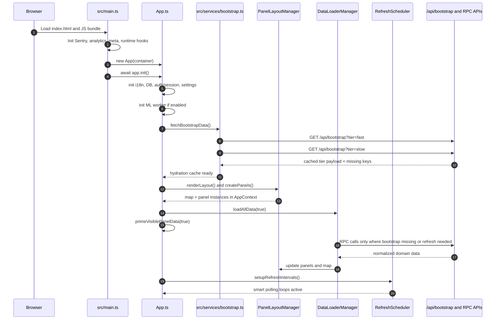
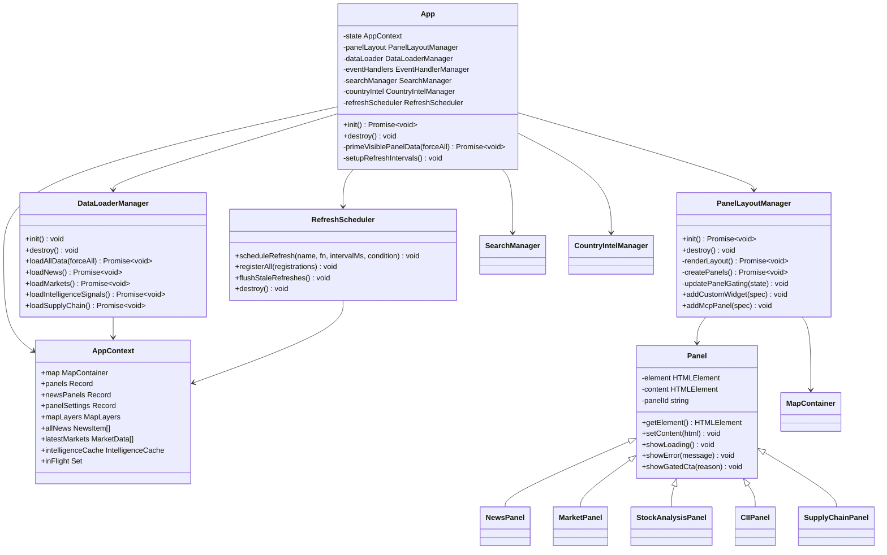
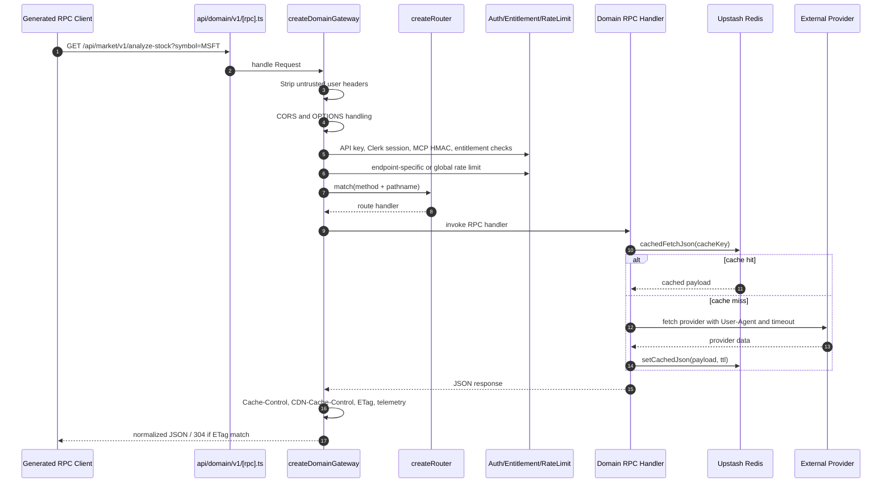
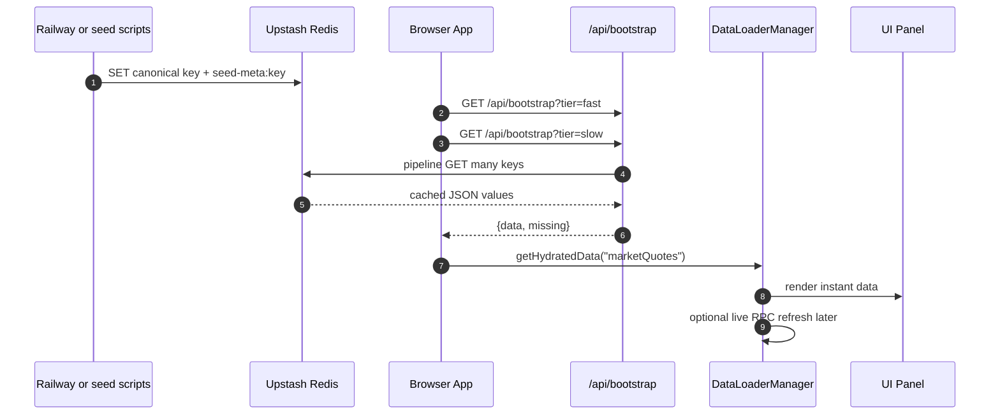
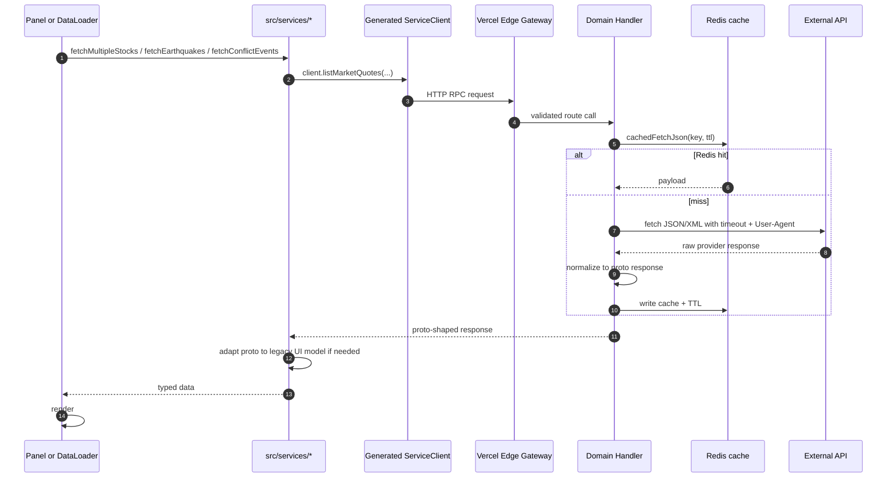
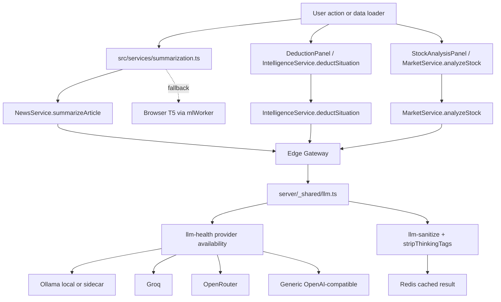
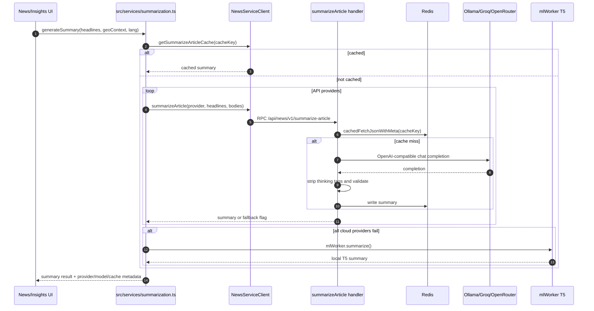

# WorldMonitor Architecture Analysis

Tai lieu nay phan tich kien truc WorldMonitor dua tren source code trong repo. Trong tam la: so do Mermaid, sequence diagram, class diagram, system design best practices, luong nghiep vu tu A den Z, cach he thong lay data, cache data va su dung LLM.

## 1. Tong Quan He Thong

WorldMonitor la dashboard intelligence thoi gian gan thuc, gom cac phan chinh:

- SPA frontend TypeScript/Vite/Preact trong `src/`.
- He thong panel class-based trong `src/components/`, moi panel ke thua `Panel`.
- App orchestration trong `src/app/`: layout, data loading, refresh scheduler, event handlers, search, country intel.
- API Edge Functions trong `api/`.
- Domain server handlers trong `server/worldmonitor/<domain>/v1/`.
- Proto contract trong `proto/`, sinh client/server stubs vao `src/generated/`.
- Redis cache qua Upstash trong `server/_shared/redis.ts` va `api/bootstrap.js`.
- Tauri desktop app va Node.js sidecar trong `src-tauri/sidecar/`.
- Railway/seed services ghi du lieu vao Redis de frontend hydrate nhanh.

```mermaid
flowchart TD
  U[User Browser or Tauri Desktop] --> SPA[Vite SPA: src/main.ts + App.ts]

  subgraph FE[Frontend Runtime]
    SPA --> App[App orchestrator]
    App --> Layout[PanelLayoutManager]
    App --> Loader[DataLoaderManager]
    App --> Scheduler[RefreshScheduler]
    App --> Search[SearchManager]
    Layout --> Panels[Panel subclasses]
    Layout --> Map[MapContainer: DeckGL or Globe]
    Loader --> Services[src/services domain clients]
    Services --> GeneratedClient[src/generated/client sebuf RPC clients]
    Services --> Workers[Web Workers: ML, analysis, vector DB]
  end

  GeneratedClient --> API[/api/domain/vN/rpc]
  SPA --> Bootstrap[/api/bootstrap]

  subgraph EDGE[Vercel Edge API]
    API --> Gateway[createDomainGateway]
    Gateway --> Router[server/router.ts]
    Router --> Handler[server/worldmonitor domain handler]
    Bootstrap --> RedisBatch[Redis batch read]
  end

  Handler --> Redis[(Upstash Redis)]
  Handler --> Upstream[External APIs: Yahoo, Finnhub, CoinGecko, GDELT, ACLED, UCDP, FIRMS, etc.]
  Handler --> LLM[LLM providers: Ollama, Groq, OpenRouter, generic OpenAI-compatible]

  subgraph SEED[Background Data Producers]
    Railway[Railway relay and seed jobs]
    Scripts[scripts/seed-*]
  end

  Railway --> Redis
  Scripts --> Redis

  subgraph DESKTOP[Tauri Desktop]
    Tauri[Tauri shell]
    Sidecar[Node.js local-api-server.mjs]
  end

  SPA -.desktop fetch patch.-> Sidecar
  Sidecar --> Handler
  Sidecar --> Upstream
```

## 2. Repository Va Dependency Direction

Dependency direction duoc mo ta trong `AGENTS.md`:

```text
types -> config -> services -> components -> app -> App.ts
```

Y nghia:

- `src/types/`: khai bao kieu, khong import noi bo.
- `src/config/`: import tu `types`, chua variant, panels, feeds, markets, layers.
- `src/services/`: business logic, RPC clients, cache/circuit breaker adapters.
- `src/components/`: UI panel, map, modal, chart, nhan data tu services/app.
- `src/app/`: dieu phoi lifecycle, data loading, layout, event handling.
- `src/App.ts`: root orchestrator.

Voi API:

- `api/*.js` hand-written Edge Functions phai self-contained JS, khong import `src/` hay `server/`.
- `api/<domain>/v1/[rpc].ts` la domain gateway entrypoint, import generated server routes va domain handler. Vi Vercel bundle per function, deploy artifact van la self-contained.
- `server/` code duoc bundle vao Edge Function thong qua gateway.

## 3. Frontend Startup Flow

Entrypoint la `src/main.ts`, sau do tao `App` trong `src/App.ts`. `App.init()` la xương sống cua ung dung.



Key files:

- `src/main.ts`: Sentry, analytics, app creation.
- `src/App.ts`: init phases, bootstrap, layout, data loading, refresh setup.
- `src/services/bootstrap.ts`: two-tier hydration, offline cached fallback.
- `src/app/panel-layout.ts`: create map and panels.
- `src/app/data-loader.ts`: load news, markets, intelligence, supply-chain, energy, etc.
- `src/app/refresh-scheduler.ts`: register refresh loops.
- `src/services/runtime.ts`: smart poll loop, desktop fetch patch.

## 4. App Class Va UI Class Diagram



## 5. API Contract Va Gateway Design

WorldMonitor dung contract-first RPC qua protobuf va sebuf:

```mermaid
flowchart LR
  Proto[proto/worldmonitor/domain/v1/*.proto] --> Generate[make generate / buf generate]
  Generate --> Client[src/generated/client]
  Generate --> Server[src/generated/server]
  Generate --> OpenAPI[docs/api/worldmonitor.openapi.yaml]
  Client --> FE[src/services and components]
  Server --> EdgeEntry[api/domain/v1/[rpc].ts]
  EdgeEntry --> Gateway[server/gateway.ts]
  Gateway --> DomainHandler[server/worldmonitor/domain/v1/handler.ts]
```

Vi du market:

- Contract: `proto/worldmonitor/market/v1/service.proto`.
- Client: `src/generated/client/worldmonitor/market/v1/service_client`.
- Edge entry: `api/market/v1/[rpc].ts`.
- Gateway: `server/gateway.ts`.
- Handler composition: `server/worldmonitor/market/v1/handler.ts`.
- Per-RPC implementation: `server/worldmonitor/market/v1/analyze-stock.ts`, `list-market-quotes.ts`, etc.

`api/market/v1/[rpc].ts` rat mong:

```ts
export default createDomainGateway(
  createMarketServiceRoutes(marketHandler, serverOptions),
);
```

Gateway pipeline:



## 6. Caching Architecture

WorldMonitor co nhieu lop cache:

```mermaid
flowchart TD
  Browser[Browser memory and persistent cache] --> Hydration[src/services/bootstrap hydrationCache]
  Hydration --> Panels[Panels consume getHydratedData once]
  Browser --> CircuitBreaker[Client circuit breakers with stale fallback]
  CircuitBreaker --> RPC[Generated RPC clients]
  RPC --> CDN[Vercel/Cloudflare HTTP cache headers]
  CDN --> Gateway[Edge gateway]
  Gateway --> RedisCache[server/_shared/redis cachedFetchJson]
  RedisCache --> Upstream[External APIs]
  Seeders[Railway and scripts seed jobs] --> RedisCanonical[Canonical Redis keys]
  RedisCanonical --> BootstrapAPI[/api/bootstrap batch read]
  RedisCanonical --> Handlers[Domain handlers read seeded keys]
```

Cache mechanisms trong code:

- `api/bootstrap.js`: batch GET Redis keys theo tier `fast` va `slow`; tra ve `{ data, missing }`.
- `src/services/bootstrap.ts`: goi fast + slow song song, co abort budget, luu vao in-memory `hydrationCache`, fallback persistent cache khi offline.
- `src/services/market/index.ts`: dung `getHydratedData()` truoc khi goi RPC, va warm circuit breaker cache.
- `server/_shared/redis.ts`: `cachedFetchJson()` va `cachedFetchJsonWithMeta()`:
  - Redis read truoc.
  - In-flight coalescing de tranh stampede.
  - Negative sentinel `__WM_NEG__` khi upstream null/fail.
  - Fetcher timeout mac dinh 30s de khong poison isolate.
  - Short local fallback khi Redis bi loi.
- `server/gateway.ts`: gan cache tier headers: `fast`, `medium`, `slow`, `slow-browser`, `static`, `daily`, `no-store`, `live`.

## 7. Data Flow: Lay Data Tu Dau Va Di Qua Dau

Co 3 duong data chinh.

### 7.1 Bootstrap Hydration Path

Dung cho du lieu da duoc seed san vao Redis.



Vi du bootstrap keys: `marketQuotes`, `commodityQuotes`, `sectors`, `riskScores`, `flightDelays`, `predictions`, `forecasts`, `ucdpEvents`, `shippingRates`, `climateAnomalies`, `cyberThreats`, `consumerPricesOverview`.

### 7.2 Live RPC Path

Dung khi du lieu khong co trong bootstrap, user mo panel gan viewport, hoac refresh scheduler chay.



### 7.3 Client RSS / Custom Feed Fallback

News co them pipeline rieng:

- `DataLoaderManager.loadNews()` thu `tryFetchDigest()` truoc.
- Neu server digest khong co category hoac category la custom, `loadNewsCategory()` fetch direct feeds qua `fetchCategoryFeeds()`.
- Ket qua duoc cluster, classify threat, ingest vao breaking alerts, trending keywords, CII va map signals.

## 8. LLM Architecture

LLM trong WorldMonitor co 2 nhom:

- Cloud/server-side LLM qua `server/_shared/llm.ts`.
- Browser local model qua `src/services/ml-worker.ts` va `src/services/summarization.ts`.



### 8.1 Provider Chain

`server/_shared/llm.ts` dinh nghia provider chain:

```text
ollama -> groq -> openrouter -> generic
```

Profiles:

- `callLlmTool()`: mac dinh Groq, phu hop extraction/parsing.
- `callLlmReasoning()`: mac dinh OpenRouter, phu hop synthesis/reasoning.
- `callLlmReasoningStream()`: stream SSE chunks cho reasoning response.

Credentials:

- Ollama: `OLLAMA_API_URL`, `OLLAMA_API_KEY`, `OLLAMA_MODEL`.
- Groq: `GROQ_API_KEY`.
- OpenRouter: `OPENROUTER_API_KEY`.
- Generic: `LLM_API_URL`, `LLM_API_KEY`, `LLM_MODEL`.
- Override theo profile: `LLM_TOOL_PROVIDER`, `LLM_TOOL_MODEL`, `LLM_REASONING_PROVIDER`, `LLM_REASONING_MODEL`.

Safety:

- `sanitizeForPrompt()` cho user/upstream text truoc khi append vao prompt.
- `stripThinkingTags()` loai bo `<think>`, reasoning/reflection tags.
- Provider health gate qua `isProviderAvailable()`.
- Timeout moi call.
- Validate output optional.

### 8.2 LLM Use Cases Trong Code

| Use case | Client path | Server path | Cach hoat dong |
|---|---|---|---|
| News summary | `src/services/summarization.ts` | `server/worldmonitor/news/v1/summarize-article.ts` | Client thu Ollama/Groq/OpenRouter qua RPC, server cache Redis, browser T5 fallback neu cloud fail |
| Deduct situation | `src/components/DeductionPanel.ts` | `server/worldmonitor/intelligence/v1/deduct-situation.ts` | Premium flow, build prompt tu query + geoContext + prediction market context, goi `callLlmReasoning()` |
| Stock analysis | `src/services/stock-analysis.ts` | `server/worldmonitor/market/v1/analyze-stock.ts` | Fetch Yahoo history/analyst/news, tinh technicals, goi `callLlm()` de tao AI overlay JSON |
| Market implication/daily brief | `src/app/data-loader.ts` | domain services | Gom market/regime context, goi LLM/cached services khi premium |

### 8.3 News Summary Sequence



## 9. Business Flow Tu A Den Z

Day la luong nghiep vu day du tu luc user vao app den khi dashboard co data.

1. User mo domain, vi du `worldmonitor.app`, `finance.worldmonitor.app`, `tech.worldmonitor.app`.
2. Vercel rewrite moi route SPA ve `index.html` neu khong phai `/api`, `/docs`, assets, etc. Cau hinh o `vercel.json`.
3. `src/main.ts` load CSS, init Sentry, Vercel Analytics, UTM interceptor, tao `new App(container)`.
4. `App` khoi tao `AppContext`: panel map, news cache, market cache, in-flight set, user settings, layer settings.
5. App doc variant tu config/hostname/env. Variant quyet dinh default panels/layers trong `src/config/panels.ts` va `src/config/variants/`.
6. App init i18n, IndexedDB/local storage, auth state, wm-session fetch interceptor, entitlement subscriptions.
7. Desktop only: `installRuntimeFetchPatch()` route `/api/*` sang Node sidecar, lay token qua Tauri IPC, fallback cloud neu sidecar fail.
8. App goi `fetchBootstrapData()`: fast tier va slow tier song song. Ket qua di vao hydration cache.
9. `PanelLayoutManager.renderLayout()` tao shell DOM, map container, panel grid.
10. `PanelLayoutManager.createPanels()` tao panel instance theo config hien tai. Panel premium co gating CTA neu user chua co entitlement.
11. Map dynamic import `MapContainer`, giup WebGL stack khong block initial bundle.
12. App init search, map layer handlers, country intel, URL state sync.
13. `DataLoaderManager.loadAllData(true)` chay theo batch. Chi load module can thiet theo variant, panel dang enabled, map layer dang bat, premium access.
14. Loader uu tien `getHydratedData(key)` cho data da bootstrap, render ngay.
15. Neu hydration missing hoac can live refresh, service goi generated RPC client.
16. Gateway Edge check CORS, auth/API key, entitlement, rate limit, route match.
17. Domain handler doc Redis qua `cachedFetchJson()`. Neu miss thi fetch upstream va normalize.
18. Handler tra response typed theo proto. Gateway gan cache headers, ETag, telemetry.
19. Client service adapt proto shape sang UI model neu can.
20. DataLoader update panel UI, map layers, intelligence cache, CII, signal aggregator.
21. `RefreshScheduler.setupRefreshIntervals()` dang ky smart polling theo interval va viewport condition.
22. Khi tab hidden, polling pause/giam tan suat; khi visible lai, `flushStaleRefreshes()` stagger refresh de tranh request burst.
23. User tuong tac panel/map: enable layer, search country, open country brief, run deduction, stock analysis, custom widget, MCP panel.
24. Premium path dung `premiumFetch()` de attach API key, tester key hoac Clerk Bearer dung luc.
25. Neu LLM flow, server sanitize prompt, check cache, goi provider chain, cache ket qua, tra ve UI.
26. Neu offline/partial outage, bootstrap persistent cache, circuit breakers va Redis stale/negative sentinel giup UI khong bi trang.

## 10. System Design Best Practices Dang Co

### 10.1 Contract-First API

Proto la source of truth cho public RPC. Loi ich:

- Frontend va server dung generated types.
- OpenAPI docs sinh tu contract.
- Route parity va generated freshness co CI guard.
- Them endpoint co quy trinh ro: proto -> generate -> handler -> gateway.

### 10.2 Thin Edge Entry, Fat Domain Handler

`api/<domain>/v1/[rpc].ts` chi compose route. Logic nam trong `server/worldmonitor/<domain>/v1/*.ts`.

Loi ich:

- Moi domain Edge bundle chi gom code can thiet.
- Giam cold-start.
- Handler de test rieng.

### 10.3 Cache Key Phai Include Request Parameters

Cache keys trong handlers thuong gom symbol, query, includeNews, geoContext hash, framework hash, prediction context hash.

Vi du:

- `market:analyze-stock:v3:${symbol}:...`
- `deduct:situation:v2:${queryHash}:fw...:pm...`

Best practice: moi request-varying param phai nam trong cache key, neu khong se leak/stale sai ngu canh.

### 10.4 Stampede Protection

`cachedFetchJson()` dung `inflight Map` trong Edge isolate. Nhieu request cung key share mot fetcher. Khi provider loi, negative sentinel TTL ngan request storm.

### 10.5 Timeout Everywhere

Patterns dang co:

- Server fetch upstream dung `AbortSignal.timeout(...)`.
- LLM co timeout rieng.
- Cache layer co wrapper timeout de release inflight slot.
- Bootstrap co fast/slow abort budget.
- Client daily brief collectors co `withTimeout()`.

### 10.6 Visibility-Aware Polling

`startSmartPollLoop()` co:

- Pause khi tab hidden.
- Refresh on visible.
- Jitter.
- Exponential backoff.
- In-flight guard.
- Abort active request khi hidden.

### 10.7 Circuit Breaker Tren Client

Services nhu market dung `createCircuitBreaker()` de co stale fallback va persistent cache, tranh UI collapse khi API fail.

### 10.8 Auth/Tier Gate O Ca Client Va Server

Client gating giup UX tot hon, nhung server gateway moi la authority:

- `premiumFetch()` attach token/key dung path.
- `server/gateway.ts` check API key, Clerk session, entitlement, MCP HMAC.
- Premium endpoints khong chi dua vao UI lock.

### 10.9 Prompt Sanitization

LLM prompt nhan data tu user va upstream feed nen co:

- Length bounds.
- `sanitizeForPrompt()`.
- Strip thinking tags.
- Validate output.
- Cache theo sanitized/effective inputs.

### 10.10 Desktop Sidecar Isolation

Desktop runtime khong goi truc tiep moi cloud path khi co sidecar:

- Renderer fetch patch route `/api/*` sang local sidecar.
- Sidecar inject secrets tu keyring.
- Sidecar monkey-patch fetch de force IPv4, SSRF guard, upstream concurrency limit, Yahoo rate gate.

## 11. Best Practices Khi Them Feature Moi

### Them data source moi

1. Xac dinh data co can public UI hydrate nhanh khong.
2. Neu co, them seed job ghi Redis canonical key va `seed-meta:<key>`.
3. Them key vao `api/bootstrap.js` neu client consume raw/hydrated key.
4. Them proto request/response va RPC trong `proto/worldmonitor/<domain>/v1/`.
5. Chay `make generate`.
6. Tao handler trong `server/worldmonitor/<domain>/v1/`.
7. Handler dung `cachedFetchJson()` va cache key gom moi param.
8. Them cache tier trong `server/gateway.ts`.
9. Tao client service trong `src/services/<domain>/`.
10. Wire vao `DataLoaderManager` va panel/map.
11. Them tests: handler unit, edge route guard, hydration coverage neu can.

### Them panel moi

1. Tao `src/components/MyPanel.ts` extend `Panel`.
2. Dang ky trong `src/config/panels.ts`.
3. Them vao variant configs neu panel default.
4. Tao service/RPC fetch logic neu can.
5. Wire loader trong `src/app/data-loader.ts`.
6. Wire refresh condition trong `src/App.ts` `setupRefreshIntervals()` neu can recurring.
7. Neu premium, them gating client va server endpoint entitlement.

### Them LLM feature moi

1. Dinh nghia endpoint proto neu feature can server-side LLM.
2. Sanitize moi user/upstream text.
3. Bound input length.
4. Dung `callLlmTool()` cho extraction, `callLlmReasoning()` cho synthesis.
5. Dung `cachedFetchJson()` voi cache key hash theo prompt inputs.
6. Dung `validate` hoac post-process output, dac biet neu JSON.
7. Dung provider fallback va fallback deterministic neu LLM fail.
8. Khong dua secret/provider key vao frontend.

## 12. Rủi Ro Thiet Ke Va Diem Can Chu Y

| Risk | Noi xuat hien | Giai phap dang co | Khuyen nghi |
|---|---|---|---|
| Upstream outage | Yahoo, Finnhub, GDELT, etc. | Redis cache, negative sentinel, circuit breaker | Luon co empty/fallback response typed |
| Cache poisoning/stale sai ngu canh | Handler cache keys | Param-specific cache key | Review cache key khi them request fields |
| Request burst khi mo tab lai | Refresh loops | smart polling + stagger flush | Giu condition gan viewport |
| Premium bypass | Client-only gating | Server gateway entitlement | Moi premium endpoint phai nam trong canonical premium path list |
| Prompt injection | RSS/body/user prompt | sanitizeForPrompt, length caps | Sanitize ca upstream text, khong chi user input |
| Edge bundle qua lon | Domain gateway | Per-domain `[rpc].ts` | Khong import cross-domain nặng vao handler |
| Desktop SSRF/secrets | Sidecar local server | SSRF guard, keyring env allowlist | Them provider moi phai qua allowlist/chinh sach fetch |

## 13. Source Code Map Theo Vai Tro

| Vai tro | File/Folder |
|---|---|
| App root | `src/main.ts`, `src/App.ts` |
| App modules | `src/app/data-loader.ts`, `src/app/panel-layout.ts`, `src/app/refresh-scheduler.ts`, `src/app/event-handlers.ts` |
| UI base | `src/components/Panel.ts` |
| Variant/panel config | `src/config/panels.ts`, `src/config/variants/*`, `src/config/variant.ts` |
| Client service layer | `src/services/*` |
| Bootstrap hydration | `src/services/bootstrap.ts`, `api/bootstrap.js` |
| RPC contract | `proto/worldmonitor/**`, `src/generated/client/**`, `src/generated/server/**` |
| Gateway/router | `server/gateway.ts`, `server/router.ts` |
| Domain handlers | `server/worldmonitor/**/handler.ts`, `server/worldmonitor/**/*.ts` |
| Cache | `server/_shared/redis.ts`, `api/_upstash-json.js` |
| LLM | `server/_shared/llm.ts`, `server/_shared/llm-health.ts`, `server/_shared/llm-sanitize.*`, `src/services/summarization.ts`, `src/services/ml-worker.ts` |
| Auth/entitlement | `src/services/premium-fetch.ts`, `server/_shared/entitlement-check.ts`, `server/_shared/auth-session.ts`, `api/_api-key.js` |
| Desktop | `src/services/runtime.ts`, `src-tauri/sidecar/local-api-server.mjs`, `src-tauri/src/main.rs` |
| Dev API routing | `vite.config.ts` `sebufApiPlugin()` |

## 14. Ket Luan Kien Truc

WorldMonitor di theo huong modular monolith cho frontend va contract-first domain gateway cho backend. Diem manh la:

- Frontend co orchestration ro, state tap trung trong `AppContext`.
- Data loader va refresh scheduler toi uu cho dashboard co nhieu panel.
- API contract proto giup type safety va OpenAPI dong bo.
- Redis cache va bootstrap hydration giam latency dang ke.
- LLM duoc dat o server-side voi provider fallback, cache va prompt sanitation.
- Desktop sidecar giup chay local/co secret ma khong lam lo key trong renderer.

Neu mo rong he thong, nen giu 4 nguyen tac: contract-first, cache-key explicit, timeout/fallback bat buoc, va server-side auth la authority.
