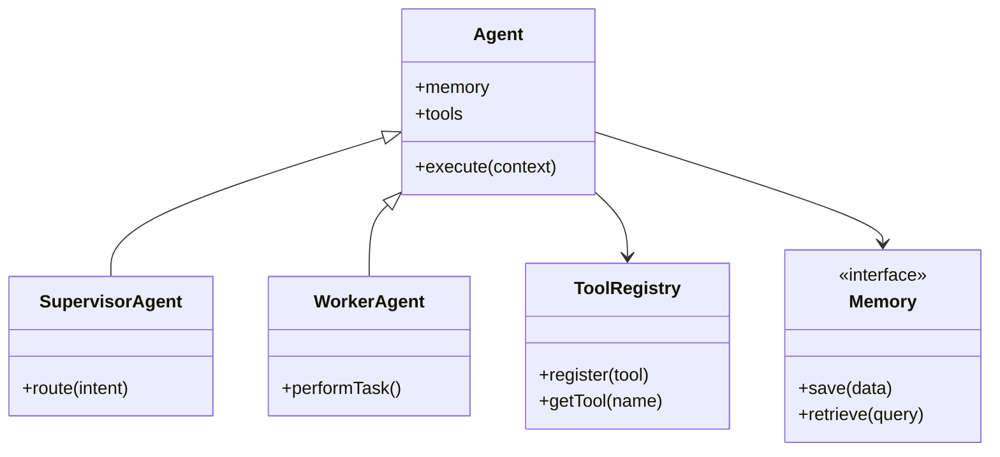

# Agent Pattern Class Diagram

[Mermaid Diagram]

```mermaid
classDiagram
    class Agent {
        +execute(context)
        +memory
        +tools
    }

    class SupervisorAgent {
        +route(intent)
    }

    class WorkerAgent {
        +performTask()
    }

    class ToolRegistry {
        +register(tool)
        +getTool(name)
    }

    class Memory {
        <<interface>>
        +save(data)
        +retrieve(query)
    }

    Agent <|-- SupervisorAgent
    Agent <|-- WorkerAgent
    Agent --> ToolRegistry
    Agent --> Memory
```
